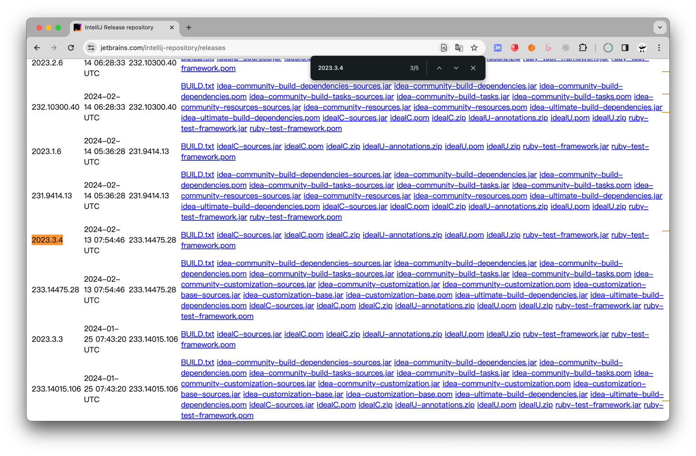
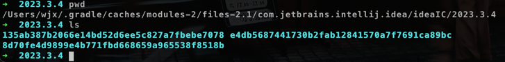

## 编译问题

### 1. NullPointerException
开启 VPN 不报错，如果没有 VPN 也可以忽略这个报错，不影响运行。
```text
> Caused by: java.lang.NullPointerException: getHeaderField("Location") must not be null
```
### 2. ResourceException
```text
> Caused by: org.gradle.api.resources.ResourceException: Could not get resource 'https://cache-redirector.jetbrains.com/www.jetbrains.com/intellij-repository/releases/com/jetbrains/intellij/idea/ideaIC/2023.3.4/ideaIC-2023.3.4-sources.jar'.
```
开启 VPN 可解决上面的报错，但由于下载的 idea 文件比较大，经常会超时：
```text
> Could not get resource 'https://cache-redirector.jetbrains.com/www.jetbrains.com/intellij-repository/releases/com/jetbrains/intellij/idea/ideaIC/xxx
> Read timed out
```
可通过手动下载需要的文件解决超时问题，https://www.jetbrains.com/intellij-repository/releases ，下面以 2023.3.4 社区版为例：

下载对应的几个文件（如果是社区版，就下载 ideaIC，如果是旗舰版，就下载 ideaIU）： 
- ideaIC.pom
- ideaIC-sources.jar
- ideaIC.zip

#### 2.1 执行命令
MacOS 系统，以 ideaIC-sources.jar 为例子，其他两个文件一样的处理方式
```shell
# 将下载的文件移到 gradle cache 目录下
> mv ideaIC-2023.3.4-sources.jar ~/.gradle/caches/modules-2/files-2.1/com.jetbrains.intellij.idea/ideaIC/2023.3.4/
> cd ~/.gradle/caches/modules-2/files-2.1/com.jetbrains.intellij.idea/ideaIC/2023.3.4/
# 计算文件的 sha1，输出 e4db5687441730b2fab12841570a7f7691ca89bc
> shasum ideaIC-2023.3.4-sources.jar
# 新建sha1同名目录
> mkdir e4db5687441730b2fab12841570a7f7691ca89bc
# 将文件移到刚刚建的目录下
> mv ideaIC-2023.3.4-sources.jar e4db5687441730b2fab12841570a7f7691ca89bc
```
